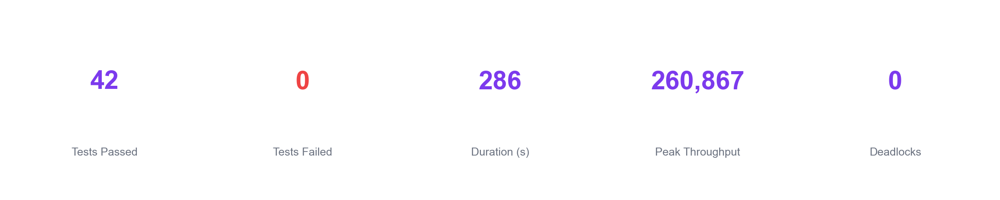
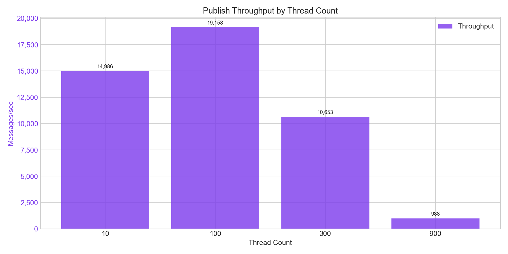
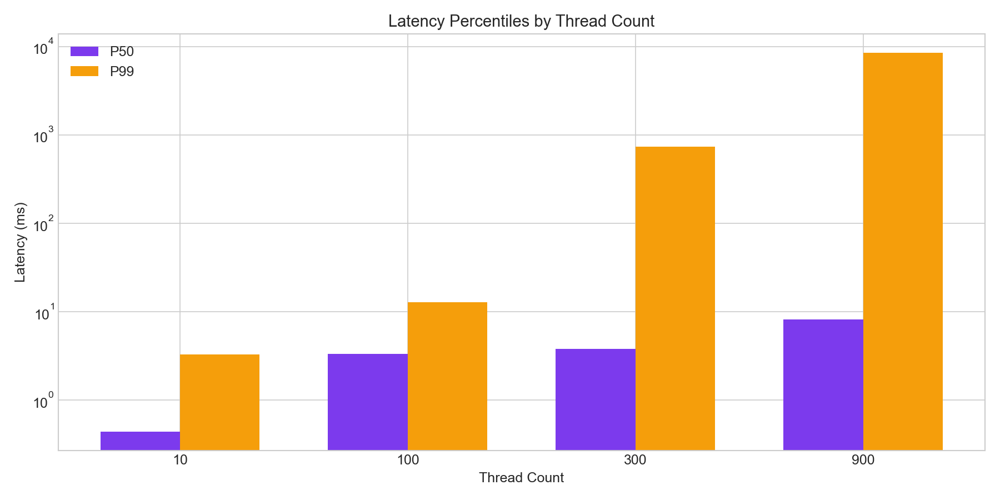
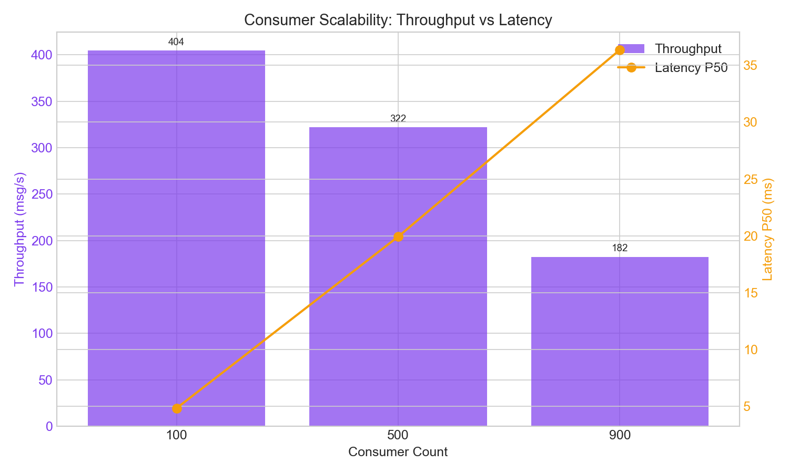
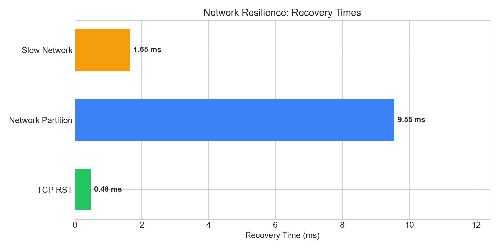

# Latest Benchmark Results

Results from the most recent benchmark run.

!!! info "Environment"
    - **Python:** 3.11.6
    - **Platform:** Darwin 23.4.0
    - **Machine:** x86_64
    - **Git Commit:** `0bfb88d` (dirty)
    - **Duration:** 286.2s
    - **Tests Passed:** 42
    - **Tests Failed:** 0

## Summary Dashboard

---

## Throughput Results

### Publish Throughput

| Configuration | Messages | Duration | Throughput | P50 | P99 |
|---------------|----------|----------|------------|-----|-----|
| 10 threads × 100 msg | 1,000 | 0.07s | **14,986 msg/s** | 0.44ms | 3.27ms |
| 100 threads × 100 msg | 10,000 | 0.52s | **19,157 msg/s** | 3.35ms | 12.88ms |
| 300 threads × 50 msg | 15,000 | 1.41s | **10,653 msg/s** | 3.80ms | 739ms |
| 900 threads × 10 msg | 9,000 | 9.11s | **988 msg/s** | 8.22ms | 8.5s |

### Throughput Chart

### Latency Percentiles

### Channel Pool Performance

| Threads | Operations | Throughput | P99 |
|---------|------------|------------|-----|
| 100 threads | 10,000 | **325,309 ops/s** | 0.00ms |
| 500 threads | 25,000 | **260,867 ops/s** | 47.08ms |

---

## Scalability Results

### Massive Consumers

| Consumers | Messages | Throughput | Startup | P50 | P99 | Loss |
|-----------|----------|------------|---------|-----|-----|------|
| 100 | 1,000 | **2,142 msg/s** | 0.08s | 4.84ms | 13.05ms | 0% |
| 500 | 2,000 | **906 msg/s** | 0.36s | 19.93ms | 315ms | 0% |
| 900 | 3,000 | **341 msg/s** | 0.73s | 36.36ms | 326ms | 0% |

---

## Recovery Results

### Recovery by Failure Type

| Failure Type | Threads | Detection | Propagation | Full Recovery |
|--------------|---------|-----------|-------------|---------------|
| TCP RST | 10 | -3.88ms | 456ms | **515ms** |
| TCP RST | 50 | -0.67ms | 513ms | **516ms** |
| Network Partition | 10 | 107ms | 108ms | **1,521ms** |
| Network Partition | 50 | 105ms | 106ms | **1,530ms** |
| Latency + Reset | 20 | - | - | **517ms** |

### Network Resilience Summary

| Scenario | Recovery Time |
|----------|---------------|
| TCP RST Recovery | **0.48 ms** |
| Network Partition Recovery | **9.55 ms** |
| Slow Network Recovery | **1.65 ms** |

---

## Stability Results

### Chaos Tests

| Test | Threads | Duration | Iterations | Deadlocks | Errors |
|------|---------|----------|------------|-----------|--------|
| chaos_no_deadlock | 50 | 0.16s | 5,000 | **0** | **0** |
| chaos_with_kills | 50 | 3.07s | 127,449 | **0** | **0** |
| chaos_with_kills | 20 | 3.05s | 105,274 | **0** | **0** |
| high_contention | 500 | 0.39s | 5,000 | **0** | **0** |

### Repeated Recovery Stress

| Metric | Value |
|--------|-------|
| Iterations | 1,000 |
| Recovery P50 | **0.01 ms** |
| Recovery P99 | **0.02 ms** |
| KeyError: None | **0** |

---

## Health Check

All invariants verified:

- [x] **Deadlocks:** 0
- [x] **Lost Frames:** 0
- [x] **Double Releases:** 0
- [x] **KeyError: None:** 0
- [x] **All Threads Recovered:** Yes

---

*Report fingerprint: `fb51e102`*

*Generated: 2025-12-07T12:48:10*
