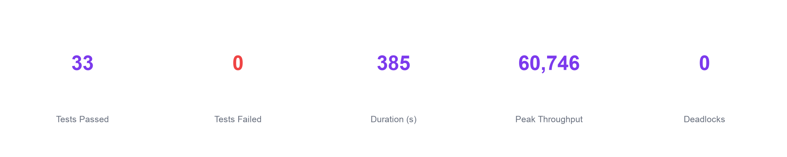
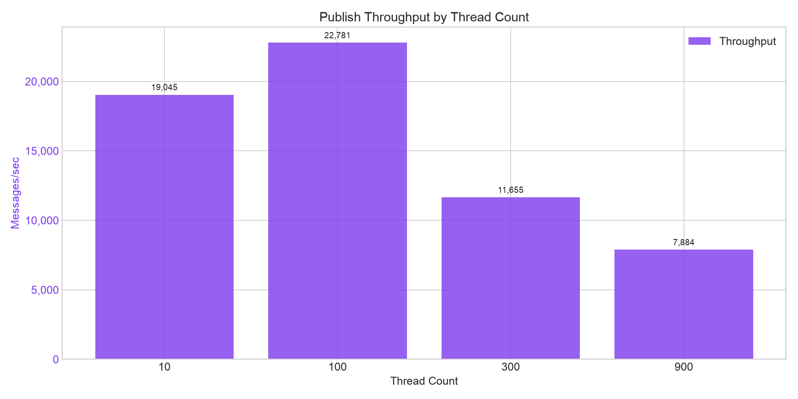
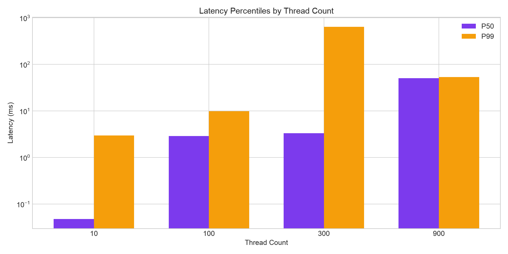
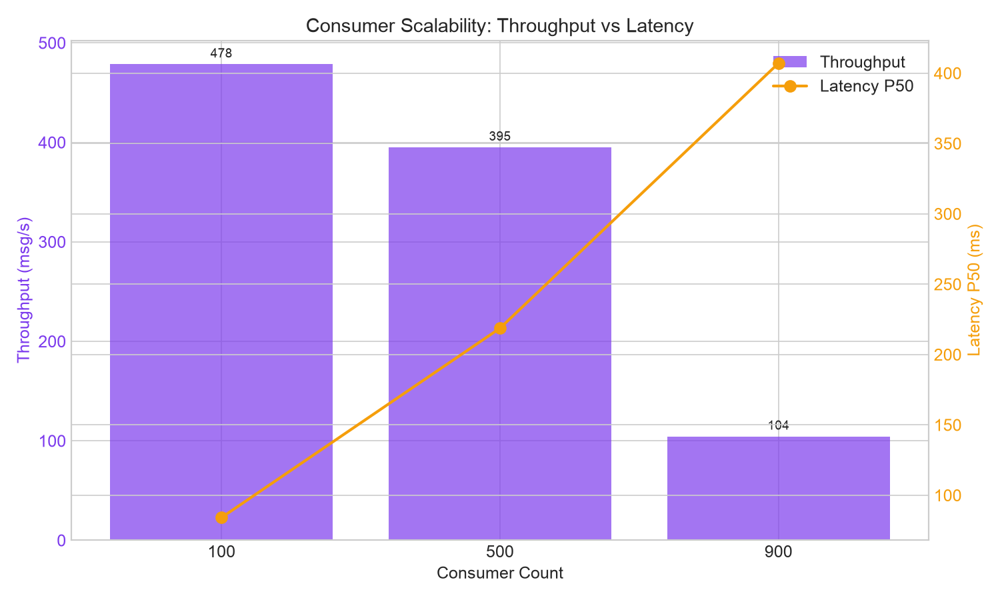
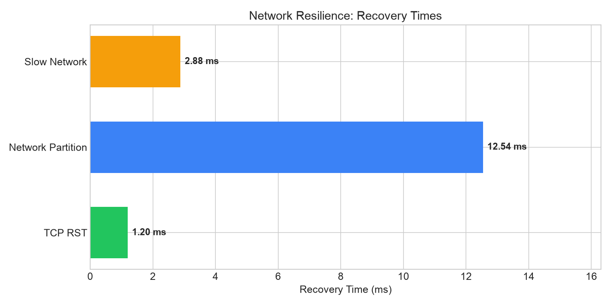

# Latest Benchmark Results

Результаты последнего запуска бенчмарков.

!!! info "Environment"
    - **Python:** 3.14.2
    - **Platform:** Darwin 25.5.0
    - **Machine:** arm64
    - **Git Commit:** `241f453` (dirty)
    - **Duration:** 389.2s
    - **Tests Passed:** 33
    - **Tests Failed:** 0

## Summary Dashboard



### Key Metrics

```vegalite
{
  "$schema": "https://vega.github.io/schema/vega-lite/v5.json",
  "width": 600,
  "height": 100,
  "data": {
    "values": [
      {"category": "Tests Passed", "value": 33, "color": "#22c55e"},
      {"category": "Tests Failed", "value": 0, "color": "#ef4444"},
      {"category": "Duration (s)", "value": 389, "color": "#3b82f6"}
    ]
  },
  "mark": {"type": "bar", "cornerRadius": 4},
  "encoding": {
    "x": {"field": "value", "type": "quantitative", "title": null},
    "y": {"field": "category", "type": "nominal", "title": null},
    "color": {"field": "color", "type": "nominal", "scale": null}
  }
}
```

## Throughput Results

### Publish Throughput

| Configuration | Messages | Duration | Throughput | P50 | P99 |
|---------------|----------|----------|------------|-----|-----|
| 10 threads × 100 msg | 1,000 | 0.07s | **13,537 msg/s** | 0.08ms | 3.62ms |
| 100 threads × 100 msg | 10,000 | 0.44s | **22,807 msg/s** | 2.96ms | 7.56ms |
| 300 threads × 50 msg | 15,000 | 1.27s | **11,815 msg/s** | 3.31ms | 628.51ms |
| 900 threads × 10 msg | 9,000 | 1.14s | **7,912 msg/s** | 49.93ms | 55.05ms |

### Throughput Chart



??? tip "Interactive Chart (Vega-Lite)"
    ```vegalite
    {
      "$schema": "https://vega.github.io/schema/vega-lite/v5.json",
      "width": 500,
      "height": 300,
      "data": {
        "values": [
          {"threads": 10, "throughput": 13537},
          {"threads": 100, "throughput": 22807},
          {"threads": 300, "throughput": 11815},
          {"threads": 900, "throughput": 7912}
        ]
      },
      "mark": {"type": "line", "point": {"filled": true, "size": 100}},
      "encoding": {
        "x": {"field": "threads", "type": "ordinal", "title": "Thread Count", "axis": {"labelAngle": 0}},
        "y": {"field": "throughput", "type": "quantitative", "title": "Messages/sec", "scale": {"zero": false}}
      }
    }
    ```

### Latency Percentiles



### Channel Pool Performance

| Threads | Operations | Throughput | P99 |
|---------|------------|------------|-----|
| 100 threads | 10,000 | **71,044 ops/s** | 2.24ms |
| 500 threads | 25,000 | **20,739 ops/s** | 518.11ms |

---

## Scalability Results

### Massive Consumers

| Consumers | Messages | Throughput | Startup | P50 | P99 | Loss |
|-----------|----------|------------|---------|-----|-----|------|
| 100 | 1,000 | **11,505 msg/s** | 0.15s | 83.10ms | 611.67ms | 0% |
| 500 | 2,000 | **1,776 msg/s** | 0.66s | 205.36ms | 714.23ms | 0% |
| 900 | 3,000 | **216 msg/s** | 1.27s | 454.17ms | 1,134.05ms | 0% |



---

## Recovery Results

### Recovery by Failure Type

| Failure Type | Threads | Detection | Propagation | Full Recovery |
|--------------|---------|-----------|-------------|---------------|
| TCP RST | 10 | -7.69ms | 457ms | **513ms** |
| TCP RST | 50 | -7.35ms | 518ms | **526ms** |
| Network Partition | 10 | 105ms | 105ms | **1,521ms** |
| Network Partition | 50 | 106ms | 107ms | **1,535ms** |
| Latency + Reset | 20 | - | - | **523ms** |

### Network Resilience Summary

| Scenario | Recovery Time |
|----------|---------------|
| TCP RST Recovery | **3.83 ms** |
| Network Partition Recovery | **17.97 ms** |
| Slow Network Recovery | **5.70 ms** |



---

## Stability Results

### Chaos Tests

| Test | Threads | Duration | Iterations | Deadlocks | Errors |
|------|---------|----------|------------|-----------|--------|
| chaos_no_deadlock | 50 | 0.16s | 5,000 | **0** | **0** |
| chaos_with_kills | 50 | 24.31s | 9,456 | **0** | **0** |
| chaos_with_kills | 20 | 9.70s | 2,086 | **0** | **0** |
| high_contention | 500 | 0.56s | 500 | **0** | **0** |

### Repeated Recovery Stress

| Metric | Value |
|--------|-------|
| Iterations | 1,000 |
| Recovery P50 | **0.03 ms** |
| Recovery P99 | **0.05 ms** |
| KeyError: None | **0** |

---

## Health Check

All invariants verified:

- [x] **Deadlocks:** 0
- [x] **Lost Frames:** 0
- [x] **Double Releases:** 0
- [x] **KeyError: None:** 0
- [x] **All Threads Recovered:** Yes

---

*Report fingerprint: `d37a2123`*

*Generated: 2026-07-13T19:57:02*
